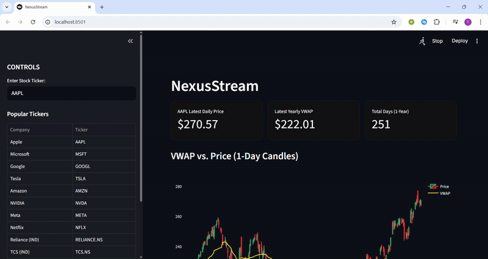

# NexusStream---VWAP-Dashboard
This Repository Contains A Data Engineering Pipeline in Python (Streamlit, yfinance, Pandas) to calculate and display historical stock VWAP (Volume-Weighted Average Price).

